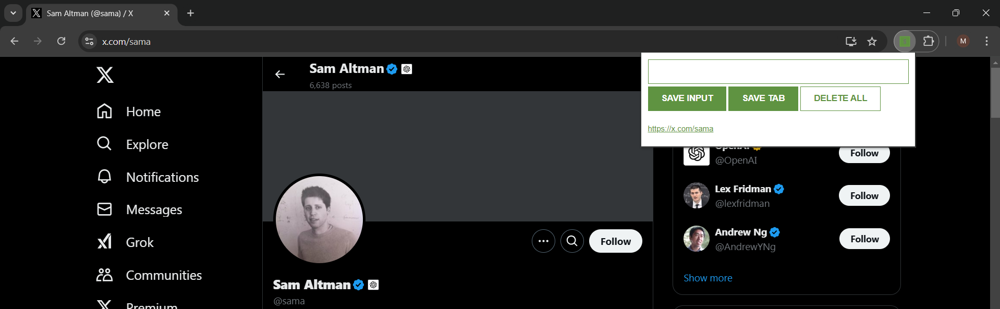
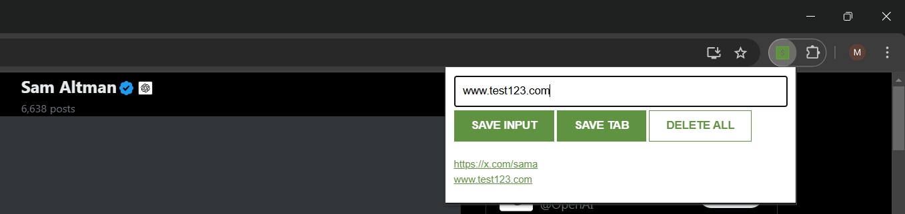

# Lead Tracker Chrome Extension

A simple and intuitive Chrome extension for tracking leads. This extension allows you to save the current tab's link, manually input links, and clear all saved leads with a double click. All data is stored in the browser's local storage.

## Features

- **Save Tab:** Quickly save the URL of the current tab with a single click.

- **Manual Input:** Add links manually to keep track of specific URLs.

- **Delete All:** Double-click to delete all saved leads.

- **Local Storage:** All data is stored locally, ensuring privacy and easy access.

## Installation

1\. Clone this repository or download it as a ZIP file.

2\. Extract the ZIP file if necessary.

3\. Open Google Chrome and navigate to `chrome://extensions/`.

4\. Enable "Developer mode" by toggling the switch in the top-right corner.

5\. Click on "Load unpacked" and select the directory where you extracted the extension.

## Usage

1\. **Save Tab:** Click the extension icon in the Chrome toolbar and press the "Save Tab" button.

2\. **Manual Input:** Enter a URL in the input field and press "Save" to add it to your leads.

3\. **Delete All:** Double-click on the "Clear All" button to delete all saved leads from local storage.

## Screenshots

## Contributing

1\. Fork the repository.

2\. Create a new branch: `git checkout -b feature-branch-name`.

3\. Make your changes and commit them: `git commit -m 'Add some feature'`.

4\. Push to the branch: `git push origin feature-branch-name`.

5\. Submit a pull request.

